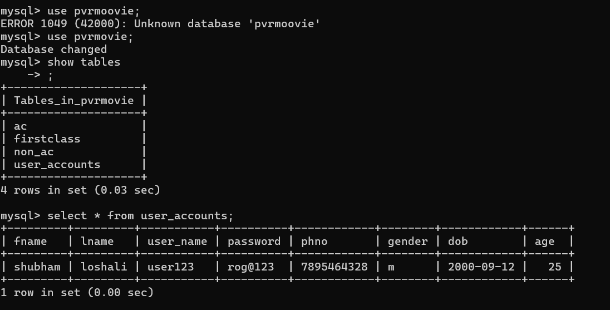
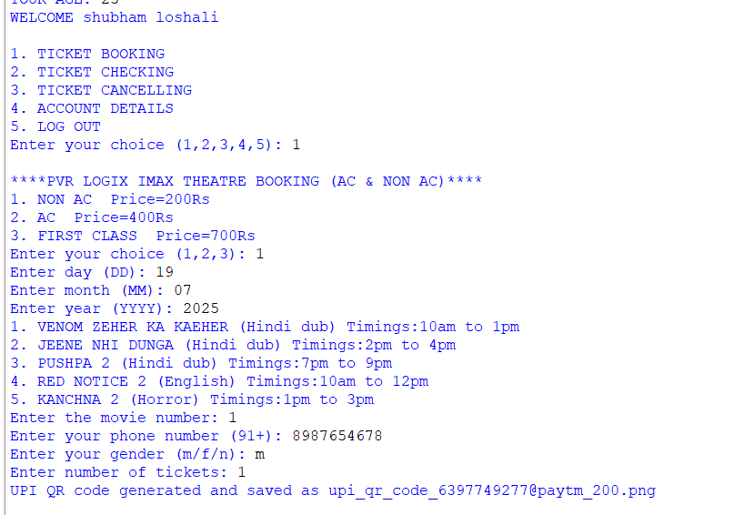
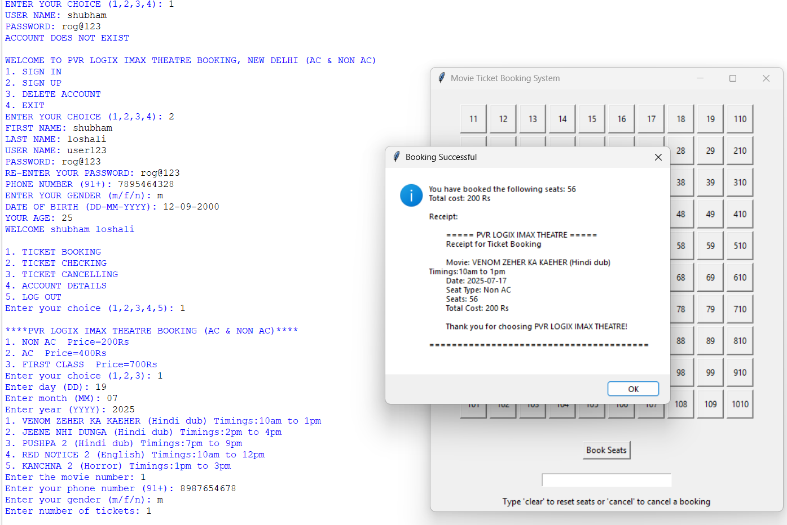
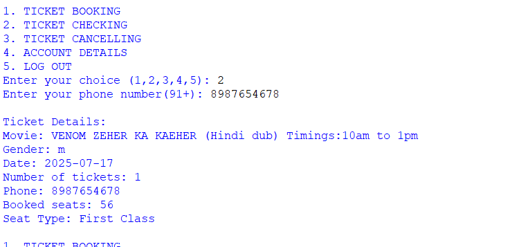
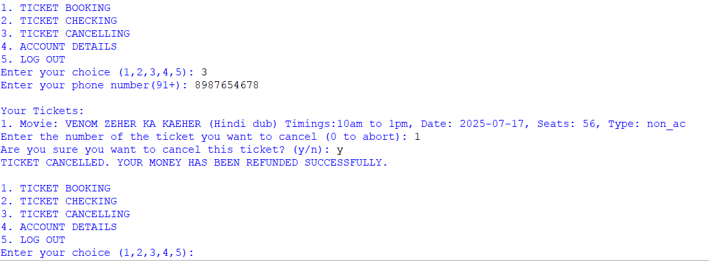

# 🎬 Movie Ticket Booking System

A fully functional **Python-based movie ticket booking system** with a graphical interface, **MySQL** database integration, **UPI QR code generation**, and real-time **seat selection**. Designed for smooth user experience and ease of booking, cancellation, and payment.

---

## 🚀 Features

- 🔐 **User Authentication** (Sign Up / Sign In / Delete Account)
- 🎟️ **Seat Booking** with 10x10 live grid (color-coded)
- 💺 **Seat Types**: Non AC | AC | First Class
- 🗓️ **Date-based movie scheduling**
- 📲 **UPI QR Code Generator** for seamless payments
- 📄 **Receipt Generation** for booking/cancellation
- 🔎 **Ticket Checking & Account Info**
- 🧾 **MySQL** powered backend.

---

## 📸 GUI Screenshots

### 🔐 Sign In / Sign Up  


---


### 💽 MySQL User Table  


---

### 🎫 Ticket Booking  


---

### 🧾 UPI QR Code  


---

### ✅ Seat Booking + Receipt  


---

### 🔍 Ticket Checking  


---

### ❌ Ticket Cancellation  


---


---

## 🛠️ Tech Stack

| Tool       | Purpose                            |
|------------|------------------------------------|
| `Python`   | Core language                      |
| `Tkinter`  | GUI for seat grid and input        |
| `MySQL`    | Database for user and ticket data  |
| `qrcode`   | QR code generation for UPI payment |
| `datetime` | Date handling and booking logic    |

---

## ⚙️ Setup Instructions
### 1. Install Dependencies

pip install mysql-connector-python

pip install qrcode[pil]

### 2. Clone the Repo

```bash
git clone https://github.com/YourUsername/Movie-ticket-bookking.git
cd Movie-ticket-bookking
